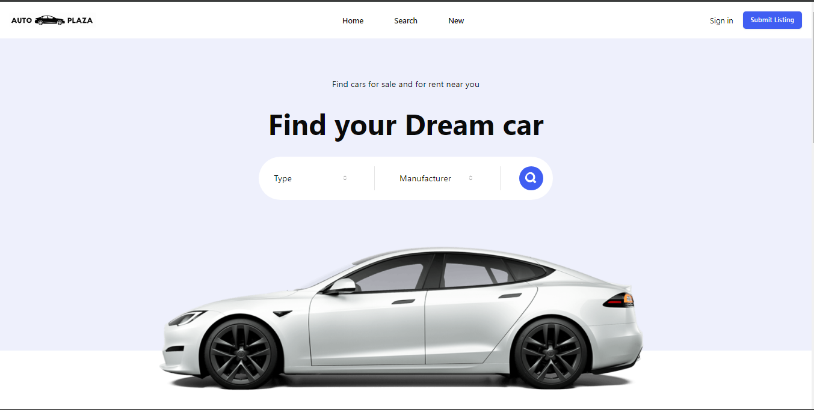

# Auto Plaza

Auto Plaza is a platform that allows users to add listings to sell their cars or browse through available car listings. Users can authenticate securely using **Clerk**, with a modern and responsive interface built with **ShadCN**, **Tailwind CSS**, and **React**. The backend utilizes **Drizzle ORM** with **PostgreSQL** for managing listings, while **Firebase** is used to store car images.

## Features

- **User Authentication**: Secure user login and registration using Clerk.
- **Car Listings**: Users can create new car listings or browse existing ones.
- **Image Storage**: Firebase is used for storing car images.
- **Responsive UI**: Built with React, Tailwind CSS, and ShadCN for a sleek and responsive user interface.
- **Database**: PostgreSQL for storing listing data, integrated with Drizzle ORM for easy database interaction.

## Technologies Used

- **Frontend**: React, Tailwind CSS, ShadCN
- **Backend**: Node.js with Drizzle ORM
- **Database**: PostgreSQL
- **Authentication**: Clerk
- **Image Storage**: Firebase

## Deployment

Since Auto Plaza is a cloud-based application, it does not require a dedicated server. Here’s how to deploy it:

### Frontend Deployment

The frontend is deployed on **Vercel** for seamless hosting of React applications.

- **Vercel**: Vercel is a popular platform for deploying React apps with automatic continuous deployment from GitHub.
  
  To deploy your frontend to Vercel:
  1. Push your code to GitHub.
  2. Go to [Vercel](https://vercel.com/), log in, and connect your GitHub repository.
  3. Vercel will automatically detect your React project and deploy it.

##Installation
###To run Auto Plaza locally, follow these steps:
```
git clone [https://github.com/devinsomniac/AutoPlaza.git]
cd auto-plaza
npm install
```
##Set Up Environment Variables
###Create a .env file in both the client and server directories and add the necessary environment variables. Example:
```
REACT_APP_API_URL=https://your-backend-url.com
REACT_APP_FIREBASE_API_KEY=your_firebase_api_key

```

##Run the Application
```
npm run dev
```
## Usage

- **Add a Listing**: After authenticating, users can add a new car listing with images.
- **Browse Listings**: View available car listings, sorted by various filters.
- **Authentication**: Users can sign up or log in using Clerk for a secure experience.

##Demo
###Here are some screenshots of the key features:

- **Homepage**
  
